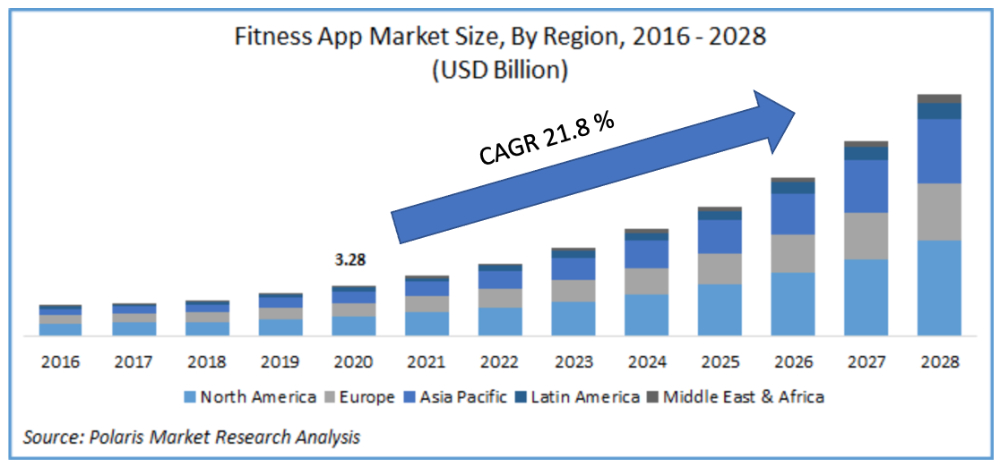
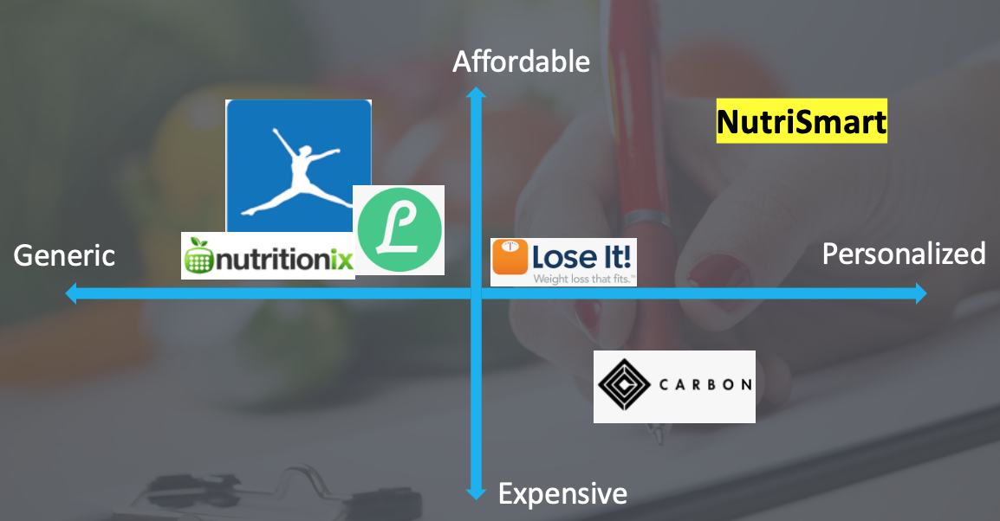

# NutriSmart

NutriSmart is an AI-based calorie and macro tracking app. It's ultimate mission is to provide an effortless nutrition tracking mechanism that is both budget- and diet-specific. It adopts the Natural Language Processing tool from the [Nutritionix](https://www.nutritionix.com/) to process and extract food items and their quantities from the user's daily food log. The daily food log can either be provided in a text box in the app or by simply talking to the app. Equipped with the speech recognition technology, NutriSmart makes tracking the macros simple and effortless. 

Check out the live app: https://nutrismartapp.herokuapp.com/  
**_Bad News: The speech recognition engine of the app deployed on Heroku does not work and if you want that you have to install pyaudio on Heroku and good luck with that ;)._**

**_Good News: The app is fully functional locally, i.e., you can enjoy the speech recognition feature if you install the packages in requirement.txt along with the pyaudio._**

## Inspiration
Everyone wants to live a happy life and fitness is one the ways to achieve that
To stay fit exercising and maintaining a healthy diet are essential. Between these two the latter is more challenging, simply because tracking your nutrition can become difficult over a sustained period of time. There are both well-known and great fitness and nutrition apps out there, however, I found it difficult to track my nutrition and wanted something more personal in a way that it suggests foods based on my diet and budget. NutriSmart is designed to make tracking nutrition easy by simply talking to the app and personalize the user experience. 

## Bussiness Objective
In addition to a solid vision, a good bussiness perspective and a potential to grow are crucial for the success of an app. As shown in the figure below, according to the Polaris Market Research Analysis, the number of fitness app users increased from 62 to 87 million users by 2020 and the global app market was valued around 3 billion US dollars and is expected to grow at the rate of roughly 22% over next 5 years. Therefore, this is a great time to enter the market. 

## Competetive Space
In the broad competitive space of nutrition apps NutriSmart focuses on personalization and affordability as its key differentiators which make it to stand out among these giant in the fitness industry.

## The Database and Natural Language Processing Engine
To extract the food items, their quantities, and their corresponding macros (e.g. Calories, Protien, Carbs, and Fat), Nutritionix provides a robust platform that is designed to analyze and turn food-related written/spoken text into nutrition analysis using their own NLP engine. For NutriSmart to work on your local machine, you need to obtain API keys (usrname, app_id, and app_password) from Nutritionix which allows you to ping their server for food information 200 hits/day and it is free! 

## Speech Recognition Engine
For the speech recognition engine, I have used the SpeechRecognition library in Python togther with the PyAudio library. For the details on the installation, check out https://pypi.org/project/SpeechRecognition/. Make sure to install pyaudio (`pip install pyaudio`) before installing the speechrecgnition library.

## Enjoy!
